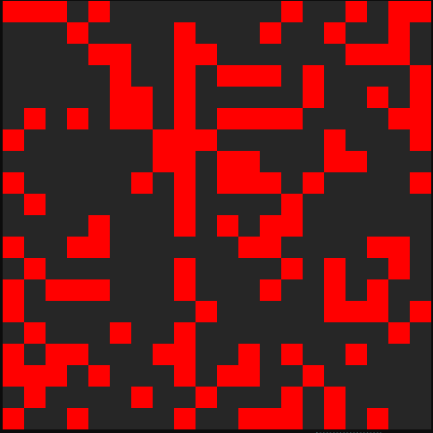

# Game of Life

Runs the [Game of Life](https://en.wikipedia.org/wiki/Conway%27s_Game_of_Life) in the console.



## Running the game

`game-of-life run [options]`

| Option | Alias | Description | Default Value |
|-|-|-|-|
| --width | -w | Sets the width of the grid. | 30 |
| --height | -h | Sets the height of the grid. | 30 |
| --iterations | -i | Sets the number of iterations to perform. | 100 |
| --initial-delay | -id | Sets the delay (in ms) for which the first iteration is shown. | 1000 |
| --delay | -d | Sets the delay (in ms) between iterations. | 200 |
| --back-color | -b | Sets the background color of the grid. | Grey15 |
| --base-color | -c | Sets the color of the cells. | Red1 |
| --pattern | -p | Seeds the initial iteration with a [known pattern](https://en.wikipedia.org/wiki/Conway%27s_Game_of_Life#Examples_of_patterns). | - |
| --qr-code | -q | Seeds the initial iteration with a QR code. | - |

When the game runs, cell aging is used to highlight cells that survive more than one generation. These cells appear in a darker color (or lighter if a dark base color is used).

### Example usage

```shell
game-of-life.exe run --width 40 --height 40 --back-color Grey15 --base-color Red1
```

### QR Codes

The initial iteration can be seeded using a [QR code](https://en.wikipedia.org/wiki/QR_code) using the `--qr-code` option.

### Using an existing QR code

A QR code in an image file can be used:

```shell
game-of-life.exe run --qr-code [qr code image path]
```

### Generating a QR code

A QR code can be generated from text:

```shell
game-of-life.exe run --qr-code "some text"
```

## Showing the available known patterns

The initial iteration can be seeded from a [known pattern](https://en.wikipedia.org/wiki/Conway%27s_Game_of_Life#Examples_of_patterns) when using the `--pattern` option.
The available patterns can be shown using the `show-patterns` command:

```shell
game-of-life.exe show-patterns
```

## Showing the available colors

The color of the grid and the cells can be set using the `--back-color` and `--base-color` options.
The available colors can be shown using the `show-colors` command:

```shell
game-of-life.exe show-colors
```
